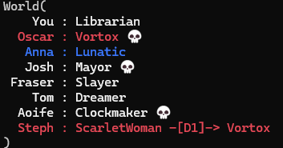

# Clockchecker 🕰️
Reddit user u/Not_Quite_Vertical posts [weekly Blood on the Clocktower puzzles](https://notquitetangible.blogspot.com/2024/11/clocktower-puzzle-archive.html). Clockchecker is a naïve solver of specifically these puzzles, which generates and checks all possible worlds. A driving motivation is for implementing new characters to be as easy as possible.
 
## Puzzle Solving Examples
<p align="center">
<table>
<tr><th>Puzzle 26</th></tr>
<tr><td><p align="center"></p></td></tr>
<tr><th>Solver Script</th></tr>
<tr><td>
 
 ```python3
from clockchecker import *

You, Olivia, Dan, Tom, Matthew, Josh, Sula, Fraser = range(8)
state = State(
    players=[
        Player(name='You', claim=Empath, night_info={
            1: Empath.Ping(0)
        }),
        Player(name='Olivia', claim=Saint),
        Player(name='Dan', claim=Slayer, day_info={
            2: Slayer.Shot(Matthew, died=False),
        }),
        Player(name='Tom', claim=Recluse),
        Player(name='Matthew', claim=Librarian, night_info={
            1: Librarian.Ping(You, Josh, Drunk)
        }),
        Player(name='Josh', claim=Soldier),
        Player(name='Sula', claim=Undertaker, night_info={
            2: Undertaker.Ping(You, Empath),
            3: Undertaker.Ping(Dan, Slayer),
        }),
        Player(name='Fraser', claim=Chef, night_info={
            1: Chef.Ping(2)
        }),
    ],
    day_events={1: Execution(You), Execution(Dan)},
    night_deaths={2: Josh, 3: Olivia},
)

for world in world_gen(
    state,
    possible_demons=[Imp],
    possible_minions=[Poisoner, Spy, Baron, ScarletWoman],
    possible_hidden_good=[Drunk],
    possible_hidden_self=[Drunk],
):
    print(world)
 ```
</td></tr>
<tr><th>Output</th></tr>
<tr><td></td></tr>
</table>

<table>
<tr><th>Puzzle 12b</th></tr>
<tr><td><p align="center"></p></td></tr>
<tr><th>Solver Script</th></tr>
<tr><td>
 
 ```python3
from clockchecker import *

You, Oscar, Anna, Josh, Fraser, Tom, Aoife, Steph = range(8)
state = State(
    players=[
        Player(name='You', claim=Librarian, night_info={
            1: Librarian.Ping(Fraser, Steph, Lunatic)
        }),
        Player(name='Oscar', claim=Investigator, night_info={
            1: Investigator.Ping(Josh, Fraser, Spy)
        }),
        Player(name='Anna', claim=Empath, night_info={
            1: Empath.Ping(1)
        }),
        Player(name='Josh', claim=Mayor),
        Player(name='Fraser', claim=Slayer),
        Player(name='Tom', claim=Dreamer, night_info={
            1: Dreamer.Ping(Steph, Lunatic, Spy)
        }),
        Player(name='Aoife', claim=Clockmaker, night_info={
            1: Clockmaker.Ping(3)
        }),
        Player(name='Steph', claim=Courtier, night_info={
            1: Courtier.Choice(Vortox)
        }),
    ],
    day_events={
        1: [
            Doomsayer.Call(caller=Tom, died=Josh),
            Slayer.Shot(src=Fraser, target=Steph, died=False),
            Doomsayer.Call(caller=Steph, died=Oscar),
            Doomsayer.Call(caller=Fraser, died=Aoife),
        ]
    },
)

for world in  world_gen(
    state,
    possible_demons=[Vortox],
    possible_minions=[Spy, ScarletWoman],
    possible_hidden_good=[Lunatic],
    possible_hidden_self=[],
):
    print(world)
 ```
</td></tr>
<tr><th>Output</th></tr>
<tr><td></td></tr>
</table>
</p>

## Usage
Run the example script (which usually just contains whatever puzzle I was implementing most recently) with:
```bash
python example.py
```
All currently solved puzzles are present as unit tests in tests.py. Run them all with
```bash
python -m unittest
```
At time of writing clockchecker is written purely in Python (3.13), because it is supposed to be fun to work on and easy to reason over, rather than efficient to run. The above unittest command today solves 32 puzzles in 10.1 seconds.

## Example Character Implementations
The hope is for characters to be easy to write, easy to read, and easy to reason over. TPI is determined to make this goal unattainable. That said, at least _some_ characters fit quite well in the clockchecker framework; some example characters taken from the `characters.py` file are below.

Reasoning over the output of character information is done using `STBool`s (StoryTeller bools) which can have value `TRUE`, `FALSE` or `MAYBE`. For example, `info.IsCharacter(Josef, IMP)` will evaluate to `MAYBE` if Josef is the Recluse, allowing the propogation of uncertainty due to Storyteller decisions.

<details open>
<summary><b>Investigator</b></summary>
 
```python
@dataclass
class Investigator(Character):
    """
    You start knowing that 1 of 2 players is a particular Minion.
    """
    category: ClassVar[Categories] = TOWNSFOLK
    is_liar: ClassVar[bool] = False
    wake_pattern: ClassVar[WakePattern] = WakePattern.FIRST_NIGHT

    @dataclass
    class Ping(info.Info):
        player1: PlayerID
        player2: PlayerID
        character: type[Character]

        def __call__(self, state: State, src: PlayerID) -> STBool:
            return (
                info.IsCharacter(self.player1, self.character)(state, src) |
                info.IsCharacter(self.player2, self.character)(state, src)
            )
```
</details>
<details>
<summary><b>Fortune Teller</b></summary>

```python
@dataclass
class FortuneTeller(Character):
    """
    Each night, choose 2 players: you learn if either is a Demon. 
    There is a good player that registers as a Demon to you.
    """
    category: ClassVar[Categories] = TOWNSFOLK
    is_liar: ClassVar[bool] = False
    wake_pattern: ClassVar[WakePattern] = WakePattern.EACH_NIGHT

    @dataclass
    class Ping(info.Info):
        player1: PlayerID
        player2: PlayerID
        demon: bool
        def __call__(self, state: State, me: PlayerID) -> STBool:
            real_result = (
                info.IsCategory(self.player1, DEMON)(state, me)
                | info.IsCategory(self.player2, DEMON)(state, me)
                | info.CharAttrEq(me, 'red_herring', self.player1)(state, me)
                | info.CharAttrEq(me, 'red_herring', self.player2)(state, me)
            )
            return real_result == info.STBool(self.demon)

    def run_setup(self, state: State, me: PlayerID) -> StateGen:
        # Any good player could be chosen as the red herring
        for player in range(len(state.players)):
            if info.IsEvil(player)(state, me) is not info.TRUE:
                new_state = state.fork()
                new_state.players[me].character.red_herring = player
                yield new_state
```
</details>
<details>
<summary><b>Baron</b></summary>
 
```python
@dataclass
class Baron(Character):
    """
    There are extra Outsiders in play. [+2 Outsiders]
    """
    category: ClassVar[Categories] = MINION
    is_liar: ClassVar[bool] = True
    wake_pattern: ClassVar[WakePattern] = WakePattern.NEVER

    @staticmethod
    def modify_category_counts(bounds: CategoryBounds) -> CategoryBounds:
        (min_tf, max_tf), (min_out, max_out), mn, dm = bounds
        bounds = (min_tf - 2, max_tf - 2), (min_out + 2, max_out + 2), mn, dm
        return bounds
```
</details>
<details>
<summary><b>Drunk</b></summary>
 
```python
@dataclass
class Drunk(Character):
    """
    You do not know you are the Drunk. 
    You think you are a Townsfolk character, but you are not.
    """
    category: ClassVar[Categories] = OUTSIDER
    is_liar: ClassVar[bool] = True

    def run_setup(self, state: State, me: PlayerID) -> StateGen:
        drunk = state.players[me]
        # Drunk can only 'lie' about being Townsfolk
        if drunk.claim.category is not TOWNSFOLK:
            return
        drunk.droison_count += 1
        self.wake_pattern = drunk.claim.wake_pattern
        yield state
```
</details>
<details>
<summary><b>Scarlet Woman</b></summary>
 
```python
@dataclass
class ScarletWoman(Character):
    """
    If there are 5 or more players alive & the Demon dies, you become the Demon.
    (Travellers don't count).
    """
    category: ClassVar[Categories] = MINION
    is_liar: ClassVar[bool] = True
    wake_pattern: ClassVar[WakePattern] = WakePattern.MANUAL

    def death_in_town(self, state: State, death: PlayerID, me: PlayerID) -> None:
        """Catch a Demon death. I don't allow catching Recluse deaths."""
        scarletwoman = state.players[me]
        dead_player = state.players[death]
        living_players = sum(not p.is_dead for p in state.players)
        if (
            not scarletwoman.is_dead
            and scarletwoman.droison_count == 0
            and dead_player.character.category is DEMON
            and living_players >= 4
        ):
            if state.night is not None:
                scarletwoman.woke()
            state.character_change(me, type(dead_player.character))
```
</details>
<details>
<summary><b>Generic Demon</b></summary>

 ```python
@dataclass
class GenericDemon(Character):
    """
    Many demons just kill once each night*, so implment that once here.
    """
    category: ClassVar[Categories] = DEMON
    is_liar: ClassVar[bool] = True
    wake_pattern: ClassVar[WakePattern] = WakePattern.EACH_NIGHT_STAR

    def run_night(self, state: State, night: int, me: PlayerID) -> StateGen:
        """Override Reason: Create a world for every kill choice."""
        demon = state.players[me]
        if night == 1 or demon.is_dead or demon.droison_count:
            yield state
            return
        for target in range(len(state.players)):
            new_state = state.fork()
            target_char = new_state.players[target].character
            yield from target_char.attacked_at_night(new_state, target, me)
```
</details>

<details>
<summary><b>No Dashii</b></summary>

```python
@dataclass
class NoDashii(GenericDemon):
    """
    Each night*, choose a player: they die. 
    Your 2 Townsfolk neighbors are poisoned.
    """
    tf_neighbour1: PlayerID | None = None
    tf_neighbour2: PlayerID | None = None

    def run_setup(self, state: State, src: PlayerID) -> StateGen:
        # I allow the No Dashii to poison misregistering characters (e.g. Spy),
        # so there may be multiple possible combinations of neighbour pairs
        # depending on ST choices. Find them all and create a world for each.
        N = len(state.players)
        fwd_candidates, bkwd_candidates = [], []
        for candidates, direction in (
            (fwd_candidates, 1),
            (bkwd_candidates, -1),
        ):
            for step in range(1, N):
                player = (src + direction * step) % N
                is_tf = info.IsCategory(player, TOWNSFOLK)(state, src)
                if is_tf is not info.FALSE:
                    candidates.append(player)
                if is_tf is info.TRUE:
                    break
        # Create a world or each combination of left and right poisoned player
        for fwd in fwd_candidates:
            for bkwd in bkwd_candidates:
                new_state = state.fork()
                new_nodashii = new_state.players[src].character
                new_nodashii.tf_neighbour1 = fwd
                new_nodashii.tf_neighbour2 = bkwd
                new_nodashii.maybe_activate_effects(new_state, src)
                yield new_state

    def _activate_effects_impl(self, state: State, src: PlayerID):
        state.players[self.tf_neighbour1].droison(state, src)
        state.players[self.tf_neighbour2].droison(state, src)

    def _deactivate_effects_impl(self, state: State, src: PlayerID):
        state.players[self.tf_neighbour1].undroison(state, src)
        state.players[self.tf_neighbour2].undroison(state, src)
```
</details>
